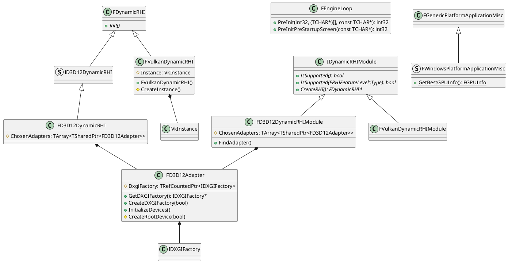
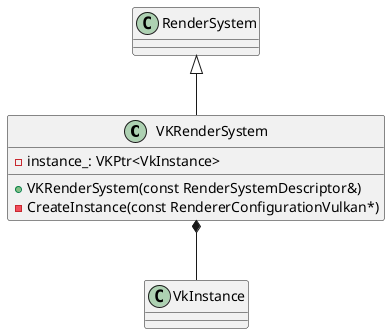
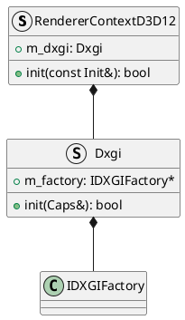
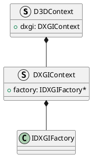

```puml
@startuml
class D3D12Context {
  -dxgi_factory: ComPtr<IDXGIFactory>
  -_select_adapter(int&): Error
}

class RenderingDeviceDriverD3D12 {
  -context: D3D12Context*
}

RenderingDeviceDriver <|-- RenderingDeviceDriverD3D12
RenderingDeviceDriverD3D12 o-- D3D12Context

class DisplayServerWindows {
  -context_rd: ApiContextRD*
  +{static}create_func(const String&, WindowMode, VSyncMode, uint32_t, const Vector2i*, const Vector2i&, int, Error&): DisplayServer*
  +{static}register_windows_driver()
  +DisplayServerWindows(const String&, WindowMode, VSyncMode, uint32_t, const Vector2i*, const Vector2i&, int, Error&)
}

DisplayServerWindows *-- ApiContextRD
ApiContextRD <|-- D3D12Context
D3D12Context *-- IDXGIFactory

class ApiContextRD {
  +{abstract}initialize(): Error
}

class VulkanContext {
  -inst: VkInstance
  -_create_instance(): Error
}

ApiContextRD <|-- VulkanContext
VulkanContext *-- VkInstance

class DisplayServer {
  -{static}singleton: DisplayServer*
  +{static}get_singleton(): DisplayServer*
  +{static}create(int, const String&, WindowMode, VSyncMode, uint32_t, const Vector2i*, const Vector2i&, int, Error&)
}

class DisplayServerX11 {
  -context_rd: ApiContextRD*
  +{static}create_func(const String&, WindowMode, VSyncMode, uint32_t, const Vector2i*, const Vector2i&, int, Error&): DisplayServer*
  +DisplayServerX11(const String&, WindowMode, VSyncMode, uint32_t, const Vector2i*, const Vector2i&, int, Error&)
}
class DisplayServerWayland {
  -context_rd: ApiContextRD*
  +{static}create_func(const String&, WindowMode, VSyncMode, uint32_t, const Point2i*, const Size2i&, int, Error&): DisplayServer*
  +DisplayServerWayland(const String&, WindowMode, VSyncMode, uint32_t, const Vector2i&, Error&)
}
class DisplayServerAndroid {
  -context_rd: ApiContextRD*
  +{static}create_func(const String&, WindowMode, VSyncMode, uint32_t, const Vector2i*, const Vector2i&, int, Error&): DisplayServer*
  +DisplayServerAndroid(const String&,WindowMode, VSyncMode, uint32_t, const Vector2i*, const Vector2i&, int, Error&)
}

DisplayServer <|-- DisplayServerX11
DisplayServer <|-- DisplayServerWayland
DisplayServer <|-- DisplayServerAndroid
DisplayServer <|-- DisplayServerWindows

DisplayServerX11 *-- ApiContextRD
DisplayServerWayland *-- ApiContextRD
DisplayServerAndroid *-- ApiContextRD

class RenderingDeviceDriver

class RenderingDeviceDriverVulkan {
  -context: VulkanContext*
}

RenderingDeviceDriver <|-- RenderingDeviceDriverVulkan
RenderingDeviceDriverVulkan o-- VulkanContext

class Main {
  +{static}setup(const char*, int, (char*)[], bool): Error
  +{static}setup2(): Error
}

@enduml
```

# RHI 시스템 분석 (2024.03.18)
[Home](/)

- [RHI 시스템 분석 (2024.03.18)](#rhi-시스템-분석-20240318)
- [하드웨어](#하드웨어)
  - [CPU](#cpu)
  - [GPU](#gpu)
  - [RAM / VRAM](#ram--vram)
  - [PCIe Bus](#pcie-bus)
  - [모니터](#모니터)
- [소프트웨어](#소프트웨어)
  - [운영체제](#운영체제)
    - [창 Window](#창-window)
    - [Swap Chain](#swap-chain)
- [RHI System](#rhi-system)
  - [Instance](#instance)
    - [Direct3D 12: `IDXGIFactory`](#direct3d-12-idxgifactory)
    - [Vulkan: `VkInstance`](#vulkan-vkinstance)
- [PlantUML](#plantuml)

RHI 시스템이란 render hardware interface의 약자로, 여러 그래픽스 API를 추상화 해놓은 시스템이다. 만약 본인이 그래픽스 공부 혹은 게임 엔진 개발 공부를 하고 싶은데, 여러 플랫폼을 아우르고 싶다면 반드시 만들어야 할 시스템이다. RHI 시스템의 목적은 컴퓨터와 운영체제에서 제공하는 여러 기능을 최대한으로 활용하여 모니터에 그림을 그리는 기능에 대한 기반 기능을 제공하는 것이다. 이를 위해서는 당연히 컴퓨터와 운영체제가 어떤 기능을 제공하는지, 어떻게 구성되는지 등에 대한 지식이 필수적으로 들어간다.

이 글에서 다룰 RHI 시스템은 게임이라는 맥락 안에서 다룰 것이다.

# 하드웨어

현대에서 게임 그래픽스를 경험하려면 보통 PC, 콘솔, 모바일, UMPC, 아케이드, VR 정도의 환경이 있을 것이다. 이 다섯 가지 전부 결국은 컴퓨터 위에서 작동을 하는 케이스이다. 게임이라는 프로세스를 보통 컴퓨터 안에 내장된 CPU가 실행을 할텐데, 그렇다면 그래픽스는 누가 담당하는 것일까? 잠깐 역사 얘기로 빠져보자. 과거 80년대 닌텐도에서 첫 가정용 게임기인 패미컴(NES)을 개발했을 때 그래픽스 전용 프로세서인 PPU(pixel processing unit)을 내장 시켰다. CPU는 순서대로 처리하는 것은 빠르지만 그래픽스라는 것은 모니터의 n 개의 픽셀을 한 번에 처리해야하기 때문에 성능이 좀 더 요구되었다. 자연스레 실시간 그래픽스를 요구하는 분야에서는 CPU 만으로는 성능 부족을 경험하게 되었고, 콘솔에서 사용하던 그래픽스 전용 프로세서는 PC의 영역까지 나아가서 GPU라는 용어를 탄생 시키기에 이른다.

그래픽스에서 알아야 하는 하드웨어는

1. CPU
2. GPU
3. RAM / VRAM
4. PCIe Bus
5. 모니터

위의 다섯가지이다.

## CPU

CPU를 알아야 하는 이유는 우리가 제작할 게임 프로그램을 실행하는 주체이기 때문이다. CPU가 직접 모니터에 그림을 그려주지는 않더라도, 그림을 그리기 위한 준비물, 환경 등을 설정해줘야 나중에 GPU한테 실제 그리는 일을 부탁할 수 있다. 사실상 RHI 시스템의 핵심은 GPU에게 일을 시키기 위한 일련의 과정들이다. 레이트레이싱을 해줘라, 어느 정도 크기의 텍스처를 할당해달라 등등... 그렇기에 CPU와 GPU가 분리 되어있다는 상황에서 CPU의 역할을 이해하는 것이 중요하다. 혹여나 내장 그래픽 프로세서를 보고 CPU와 GPU가 분리 되어 있다는 말을 이해하지 못할 수도 있다. 내장 그래픽이 있다고 해서 CPU가 곧 GPU의 역할까지 한다는 것이 아니다. 그저 같은 칩셋 내부에 CPU와 GPU가 동봉되어 있다는 의미이지 결국에 프로세서 자체는 다르다.

## GPU

Graphics Processing Unit. 이름부터 그래픽스 처리 장치로 병렬로 동일한 작업을 하는데 탁월한 성능을 보이는 장치이다. 모니터에 그림을 그리는 것이 이 특징에 잘 맞는데, 한 프레임을 그릴 때 CPU처럼 한 픽셀 한 픽셀을 그리는 것이 아닌 여러 코어들이 동일한 작업을 한 번에(병렬) 수행한다. 이때 코어들이 수행하는 작업은 CPU에서 프로그램을 실행하는 것과 동일하다. GPU에게 실행할 프로그램과 매개변수를 주면, 이를 실행할 뿐이다. CPU에서는 이 프로그램을 보통 C++ 언어를 사용하여 컴파일한 결과를 수행하지만, GPU에서는 shader language라는 언어를 컴파일한 결과를 pipeline이라는 입력변수에 동봉하여 GPU에 주어 수행한다. 이를 위해 마이크로소프트의 HLSL(High-Level Shading Language) 혹은 Khronos Group의 GLSL(OpenGL Shading Language) 등의 shader 언어를 사용한다.

## RAM / VRAM

일반적으로 CPU와 GPU는 서로 다른 처리 장치이기에 서로 다른 메모리를 사용한다(외장 그래픽 카드의 경우). 이때 GPU가 사용하는 RAM을 Video RAM이라고 하여 VRAM이라 부르기도 한다. 굳이 동일한 메모리를 사용하지 않도록 한 이유는 콘솔 환경과는 달리 GPU가 필수가 아닌 환경이기 때문이다. 콘솔의 경우 기본적으로 게임을 하겠다는 환경이므로 GPU가 필수적이므로 CPU와 GPU가 동일한 메모리를 공유하게 된다. 이러한 환경을 UMA(unified memory architecture)이라 부른다. 외장 그래픽 카드를 사용하더라도 RAM의 절반 정도는 공유 메모리로 사용하긴 한다.

## PCIe Bus

외장 그래픽 카드를 사용하는 경우 GPU의 VRAM에 데이터를 전송해주어야 한다. 이때 마더보드의 PCIe Bus를 통해 통신하게 된다. PCIe Bus의 성능에 따라 한 프레임에 GPU에 보낼 수 있는 메모리의 양(bandwidth)과 속도가 결정된다.

## 모니터

GPU가 최종적으로 그림을 그린 결과를 출력해주는 장치이다. 픽셀로 구성되어 있으며, 운영체제의 compositor이라는 시스템에서 화면을 관리한다.

# 소프트웨어

그래픽스에서 알아야 하는 소프트웨어는 운영체제이다.

## 운영체제

모니터에 그림을 그린다는 것은 결국 어떤 2차원 배열로 구성된 이미지를 모니터에 전송해주었다는 것이다. 그렇다면 어딘가에는 이 2차원 배열이 메모리 위에 있을 것이고, 우리는 이걸 직접 write를 하여 그린다고 생각한다. 실제로는 해당 2차원 배열은 운영체제의 compositor manager이 관리를 한다. 운영체제는 GUI와 같이 여러 시각적인 요소들이 있고, 이것을 매 프레임 모니터에 공급을 해준다. 각 창마다 모니터를 차지하는 범위도 다를 것이고, 창마다 서로 범위를 가리기도 할 것이며, 어떤 창은 여러 모니터에 걸쳐 있을 수도 있다.

### 창 Window

창이라는 것은 단순히 시각적인 요소만 담당하는 것이 아닌, 사용자의 입력 장치와의 상호작용까지도 다룬다. 창 위에 버튼이 있다면, 마우스로 버튼을 클릭하는 것과 같은 상호작용 로직은 창에서 처리를 해야 하는 것이다. 만약 게임 프로그램을 실행한다면, 게임 창에서 게임 화면을 그려주고, 키보드와 마우스의 조작에 따라 게임이 반응을 해야 한다.

### Swap Chain

모니터의 주사율이 아무리 높더라도 게임 그래픽스는 안정적인 속도로 일정하게, 그리고 완전하게 출력을 해주어야 한다. 가령 모니터에 그릴 2차원 배열이 하나 밖에 없다면 i 번째 프레임에 모니터에 출력되는 도중에 i + 1 번째 프레임의 그림을 준비할 수가 없게 된다. 차라리 2차원 배열을 두 개를 두는 게 낫다. i 번째 프레임에서 0 번째 배열을 출력 중이라면, 1 번째 프레임 위에 그림을 그리는 것이다. 이후 i + 1번째 프레임에서는 다 그린 1 번째 그림을 출력하고, 0 번째 배열에다가 i + 2 번째 프레임에 사용할 그림을 그리는 것이다. 이런 식으로 연속하여 모니터에 사용할 배열의 연속체를 swap chain이라 부른다.

# RHI System

이제 본격적으로 RHI System을 구성해보자.

## Instance

일단 Graphics API를 사용하기 위한 중앙 매니저가 필요하다. 이 매니저의 역할은 Graphics API마다 다를 수는 있다. 대표적인 역할은 다음과 같다:

1. 커널 모드 그래픽스 드라이버와 실제 하드웨어(GPU)와 어플리케이션/D3D12 간의 실제 연결을 담당
   1. 사용할 수 있는 GPU 장치 탐색
2. 모니터 관련 제어
   1. Swap Chain 생성
   2. Full-Screen 모드 제어
   3. 모니터 회전 제어

### Direct3D 12: `IDXGIFactory`

Windows OS에는 [DXGI](https://learn.microsoft.com/en-us/windows/win32/direct3ddxgi/d3d10-graphics-programming-guide-dxgi)라는 개념이 있다. Microsoft DirectX Graphics Infrastructure이라 부르는 것으로, 그래픽스 관련 로우 레벨 작업들을 추상화하여 사용할 수 있도록 한다.

[`CreateDXGIFactory`](https://learn.microsoft.com/en-us/windows/win32/api/dxgi/nf-dxgi-createdxgifactory) 함수를 사용하여 생성한다.

실제 엔진 / 렌더러에서는 DXGIFactory를 가장 먼저 초기화를 해준다. Unreal은 조금 다른 방법을 취하는데, RHI 시스템을 초기화할 때 DXGIFactory를 먼저 만들고 시작하는 것이 아닌, 먼저 사용 가능한 GPU의 명단을 뽑아보고, 거기서 GPU를 선택한 다음 DXGIFactory를 생성한다. GPU enumeration을 할 땐 임시 DXGIFactory를 만들어서 사용한다. Crytek의 CryEngine과 Amazon의 Lumberyard에 기반을 둔 O3DE의 경우 따로 factory 개체를 저장해두지 않고, 필요할 때마다 그때그때 생성하여 사용하는 방식을 취한다.

* Factory를 먼저 생성
  * Godot
  * The Forge
  * LLGL
  * BGFX
  * Granite
* Adapter를 먼저 생성
  * Unreal
* 그때 그때 Factory를 생성
  * O3DE

### Vulkan: `VkInstance`

Vulkan의 경우 ICD(Installable Client Driver)라 불리는 GPU의 그래픽스 드라이버와 Vulkan을 연결해주기 위한 [Vulkan 로더loader](https://github.com/KhronosGroup/Vulkan-Guide/blob/main/chapters/loader.adoc)라는 것을 사용한다. 보통 PC 환경에서는 LunarG에서 제공하는 Vulkan SDK에 동봉된 라이브러리에 링킹을 해주며, Android와 같은 환경에서는 이미 운영체제에 Vulkan 로더가 동봉되어 있다. 이를 통해 Vulkan이라는 Graphics API를 사용하기 위해서는 [`VkInstance`](https://docs.vulkan.org/spec/latest/chapters/initialization.html#initialization-instances) 라는 생성하여 현재 어플리케이션이 Vulkan을 사용하는 어플리케이션이므로, 로더를 통해 ICD와 통신을 할 수 있다.

[`vkCreateInstance`](https://registry.khronos.org/vulkan/specs/1.3-extensions/man/html/vkCreateInstance.html) 함수를 사용하여 생성한다.

# PlantUML

* Unreal

AttemptVulkanInit
  FAndroidMisc::HasVulkanDriverSupport
    EstablishVulkanDeviceSupport
FVulkanDynamicRHI::CreateInstance

* Godot

* LLGL

CreateDXGIFactory
  D3D12RenderSystem::CreateFactory
    D3D12RenderSystem::D3D12RenderSystem
      AllocRenderSystem
        RenderSystem::Load
          main
        LLGL_RenderSystem_Alloc
vkCreateInstance
  VKRenderSystem::CreateInstance
    VKRenderSystem::VKRenderSystem
      AllocRenderSystem

* BGFX

* Granite

