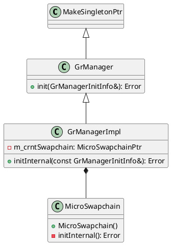

# Game Engine RHI System Analysis Series 1: Instance (2024.11.25)
[Home](/)

- [Game Engine RHI System Analysis Series 1: Instance (2024.11.25)](#game-engine-rhi-system-analysis-series-1-instance-20241125)
- [Overview](#overview)
  - [Anki](#anki)

# Overview

In order to use a Graphics API, once has to initialize something called an **Instance**. In Direct3D, the Microsoft DirectX Graphics Infrastructure or DXGI is the instance, and in Vulkan, [`VkInstance`](https://registry.khronos.org/vulkan/specs/1.3-extensions/man/html/VkInstance.html) is the instance.

The primary goal of DXGI is to manage low-level tasks that can be independent of the DirectX graphics runtime. DXGI provides a common framework for future graphics components. DXGI's purpose is to communicate with the kernel mode driver and the system hardware, as shown in the following diagram.

There is no global state in Vulkan and all per-application state is stored in a [`VkInstance`](https://registry.khronos.org/vulkan/specs/1.3-extensions/man/html/VkInstance.html) object. Creating a [`VkInstance`](https://registry.khronos.org/vulkan/specs/1.3-extensions/man/html/VkInstance.html) object initializes the Vulkan library and allows the application to pass information about itself to the implementation.

## Anki

Anki does not keep the `IDXGIFactory` in memory. It is created via `CreateDXGIFactory` API call when needed.

When initializing their graphics manager, Anki creates an [`IDXGIFactory6`](https://learn.microsoft.com/en-us/windows/win32/api/dxgi1_6/nn-dxgi1_6-idxgifactory6) by creating a [`IDXGIFactory2`](https://learn.microsoft.com/en-us/windows/win32/api/dxgi1_2/nn-dxgi1_2-idxgifactory2) from the [`CreateDXGIFactory2(UINT, REFIID, void**)`](https://learn.microsoft.com/en-us/windows/win32/api/dxgi1_3/nf-dxgi1_3-createdxgifactory2) API call, then querying `IDXGIFactory6` from the created `IDXGIFactory2` instance.

If GPU validation is required, then `DXGI_CREATE_FACTORY_DEBUG` flag is set when creating an instance.

Anki then queries the physical device(`IDXGIAdapter`s).

When creating a swap chain, an [`IDXGIFactory2`](https://learn.microsoft.com/en-us/windows/win32/api/dxgi1_2/nn-dxgi1_2-idxgifactory2) is created by the [`CreateDXGIFactory2(UINT, REFIID, void**)`](https://learn.microsoft.com/en-us/windows/win32/api/dxgi1_3/nf-dxgi1_3-createdxgifactory2) API call. The created instance is used to create a swap chain by the [`IDXGIFactory2::CreateSwapChainForHwnd(IUnknown*, HWND, const DXGI_SWAP_CHAIN_DESC1*, const DXGI_SWAP_CHAIN_FULLSCREEN_DESC*, IDXGIOutput*, IDXGISwapChain1)`](https://learn.microsoft.com/en-us/windows/win32/api/dxgi1_2/nf-dxgi1_2-idxgifactory2-createswapchainforhwnd). Anki does not support fullscreen transitions, so the instance is used to call [`IDXGIFactory::MakeWindowAssociation(HWND, UINT)`](https://learn.microsoft.com/en-us/windows/win32/api/dxgi/nf-dxgi-idxgifactory-makewindowassociation).

All these initializations happens when the graphics manager is initialized.

Just like D3D12, [`VkInstance`](https://registry.khronos.org/vulkan/specs/1.3-extensions/man/html/VkInstance.html) is initialized in the graphics manager. Unlike `IDXGIFactory`, [`VkInstance`](https://registry.khronos.org/vulkan/specs/1.3-extensions/man/html/VkInstance.html) is kept by the manager for future uses.

Instance creation in Vulkan is more complex compared to DirectX 12. In order to initialize an instance in Vulkan, one has to provide an application information [`VkApplicationInfo`](https://registry.khronos.org/vulkan/specs/1.3-extensions/man/html/VkApplicationInfo.html), an array of instance layers to enable, validation features [`VkValidationFeaturesEXT`](https://registry.khronos.org/vulkan/specs/1.3-extensions/man/html/VkValidationFeaturesEXT.html), and an array of extensions to enable.

Anki uses [`VK_LAYER_KHRONOS_validation`](https://github.com/KhronosGroup/Vulkan-ValidationLayers/blob/main/docs/khronos_validation_layer.md) instance layer if GPU validation is enabled. User can provide instance layers via command-line argument.

Anki supports [`VK_VALIDATION_FEATURE_ENABLE_DEBUG_PRINTF_EXT`](https://docs.vulkan.org/samples/latest/samples/extensions/shader_debugprintf/README.html) if enabled. If GPU validation is enabled, [`VK_VALIDATION_FEATURE_ENABLE_GPU_ASSISTED_EXT`](https://registry.khronos.org/vulkan/specs/1.3-extensions/man/html/VkValidationFeatureEnableEXT.html) is added to enabled validation features.

If user is using headless surface, [`VK_EXT_headless_surface`](https://registry.khronos.org/vulkan/specs/1.3-extensions/man/html/VK_EXT_headless_surface.html) instance extension is used. If the user is using Linux OS, [VK_KHR_wayland_surface](https://registry.khronos.org/vulkan/specs/1.3-extensions/man/html/VK_KHR_wayland_surface.html) extension is used, [`VK_KHR_win32_surface`](https://registry.khronos.org/vulkan/specs/1.3-extensions/man/html/VK_KHR_win32_surface.html) for Windows, [VK_KHR_android_surface](https://registry.khronos.org/vulkan/specs/1.3-extensions/man/html/VK_KHR_android_surface.html) for Android. To support swap chains, [VK_KHR_surface](https://registry.khronos.org/vulkan/specs/1.3-extensions/man/html/VK_KHR_surface.html) extension is used. If GPU validation is enabled, [VK_EXT_debug_utils](https://registry.khronos.org/vulkan/specs/1.3-extensions/man/html/VK_EXT_debug_utils.html) extension is used.

After creating the instance, Anki uses [Volk](https://github.com/zeux/volk) to load all required Vulkan entrypoints using `volkLoadInstance(VkInstance)`, sets debug callbacks with [`vkCreateDebugUtilsMessengerEXT(VkInstance, const VkDebugUtilsMessengerCreateInfoEXT*, const VkAllocationCallbacks*, VkDebugUtilsMessengerEXT*)`](https://registry.khronos.org/vulkan/specs/1.3-extensions/man/html/vkCreateDebugUtilsMessengerEXT.html), and creates the physical device with [`vkEnumeratePhysicalDevices(VkInstance, uint32_t*, VkPhysicalDevice*)`](https://registry.khronos.org/vulkan/specs/1.3-extensions/man/html/vkEnumeratePhysicalDevices.html).

When instance initialization is over, instance is used to create the surface. Anki supports surface creation via SDL, for Android, and for headless case.

