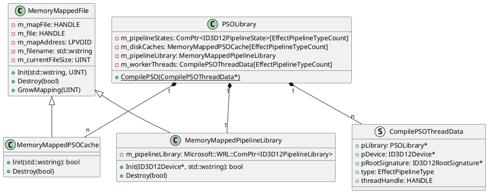

# Pipeline State Cache Studies (2024.11.22)
[Home](/)

# Introduction

The most efficient way to render using modern GPU is to utilize it's hardware's architecture. Modern GPUs uses the concept of pipelines to maximize performance. A pipeline consists of various information GPU requires to render, which includes shader cache blobs, root signatures/layouts, and additional data per stages in the pipeline. An object actually contains these info is called PSO(Pipeline State Object) in DirectX's jargon. In order to create this object, one has to ask the graphics API to create one. The API then goes to the graphics driver to request compilation of the given shader cache blob. I know that that sounds rather strange. Shader cache blobs are supposted be **compiled** data, no? Well if we are talking about general purpose hosts such as PC or Android which has no idea what GPU the system uses, how can the compiler know to which instruction set it should compile? Due to this, most shaders are compiled into intermediate languages(IL) such as DXIL(DirectX IL) or SPIR-V(The Standard IR for Parallel Compute and Graphics V(roman numeral for five)). The moment these intermediate languages compiled into actual executable instruction sets are when PSOs are created.

As everyone knows, compilation can take a chunk of runtime budget. Modern AAA games uses hundreds of shaders which are combined into tens of thousands of PSOs. Due to the rich environment these games have, the PSOs should be loaded on runtime, and the compilation becomes the major hotspot. Deploying the application with IL shader caches might make sense, but making the users keep the IL shader caches which are to be compiled into the actual instruction sets is a inefficient process. Caching the compiled PSOs into the secondary memory to be used later would definitely help improving overall performance. Users rarely alter their environment, and even if they do so, the application only has to update the first time of its launching.

Now I will give my studies on how to implement this system based on the Microsoft's sample and other game engines such as Unreal.

# Previous Works

## DirectX

### Microsoft Sample

There are two methods to implement pipeline caching. You can either cache the pipelines into a single pipeline library, or cache them per pipeline. The former requires you to initialize a pipeline library instance, and the latter requires you to call `ID3D12PipelineState::GetCachedBlob(ID3DBlob**)`.

#### Pipeline Library Method

1. `MemoryMappedPipelineLibrary::Init(ID3D12Device*, std::wstring)`
   1. `MemoryMappedFile::Init(wstring, UINT)`
      1. Creates an empty `pipelineLibrary.cache` file
      2. Create a file mapping to `pipelineLibrary.cache`
   2. Create a pipeline library based on its contents  (`ID3D12Device1::CreatePipelineLibrary(const void*, SIZE_T, REFIID, void**)`)
2. For each pipelines,
   1. `CompilePSO(CompilePSOThreadData*)`
      1. Try to load the pipeline cache from pipeline library (should fail on initial launch) (`ID3D12PipelineLibrary::LoadGraphicsPipeline(LPCWSTR, const D3D12_GRAPHICS_PIPELINE_STATE_DESC*, REFIID, void**`)
      2. If pipeline cache does not exist,
         1. Create the PSO
         2. Store the PSO (`ID3D12PipelineLibrary::StorePipeline(LPCWSTR, ID3D12PipelineState*`)
3. On application termination
   1. Write pipeline cache to file `MemoryMappedPipelineLibrary::Destroy(bool)`

#### Cached Blob Method

1. For each pipelines,
   1. `MemoryMappedFile::Init(wstring, UINT)`
   2. `CompilePSO(CompilePSOThreadData*)`
      1. Try to get the cached blobs from the disk memory (should fail on initial launch) (`D3D12_CACHED_PIPELINE_STATE`)
      2. If pipeline's cache blob does not exist,
         1. Create the PSO
         2. Get the cached blob (`ID3D12PipelineState::GetCachedBlob(ID3DBlob**)`)
         3. Write the cached blob into the memory
2. On application termination
   1. Unmap the views to the cached blobs (`UnmapViewOfFile(LPCVOID)`)

### BGFX

BGFX only uses the cached blob method.

1. `RendererContextD3D12::getPipelineState(ProgramHandle): ID3D12PipelineState*`
   1. Try to get the PSO from main memory (`RendererContextD3D12::m_pipelineStateCache: StateCacheT<ID3D12PipelineState>`)
   2. Fallback to disk memory for cached blobs if failed (`CallbackC99::cacheRead(uint64_t, void*, uint32_t): bool`)
      1. Create PSO based on the retrieved cached blob
   3. If either memory has no cached blob, create PSO manually
   4. If PSO has been created, write it back to disk memory and main memory (`ID3D12PipelineState::GetCachedBlob(ID3DBlob**)`)

### LLGL

BGFX only uses the cached blob method.

1. `D3D12GraphicsPSO::CreateNativePSO(D3D12Device&, const D3D12PipelineLayout&, const D3D12RenderPass*, const GraphicsPipelineDescriptor&, D3D12PipelineCache*)` / `D3D12ComputePSO::CreateNativePSO(D3D12Device&, const D3D12_SHADER_BYTECODE&, D3D12PipelineCache*)`
   1. Create PSO (use cached blob if given `D3D12PipelineCache*` is not null)
   2. `D3D12PipelineState::SetNativeAndUpdateCache(ComPtr<ID3D12PipelineState>&&, D3D12PipelineCache*)`
      1. If the given `D3D12PipelineCache*` is not null but an empty one, set its blob as the cached blob (`ID3D12PipelineState::GetCachedBlob(ID3DBlob**)`)

### O3DE

O3DE only uses the pipeline library method. According to O3DE, if RenderDoc or PIX is enabled, CreatePipelineLibrary API does not function properly.

LoadGraphicsPipeline
    

PipelineStateCache::CreateLibrary
    Shader::InitShader::CreateInternal
            ShaderSystem::Init
    
1. 
2. `PipelineStateCache::AcquirePipelineState(PipelineLibraryHandle, const PipelineStateDescriptor&, const AZ::Name&): const PipelineState*`
   1. Get pipeline state from read-only cache
   2. Fallback to thread-local cache
   3. Fallback to pipeline library creation
   4. `PipelineLibrary::Init(Device&, const PipelineLibraryDescriptor&): ResultCode`
      1. `PipelineLibrary::InitInternal(RHI::Device&, const RHI::PipelineLibraryDescriptor&): RHI::ResultCode`
         1. Get deserialized pipeline library cache data
         2. Create pipeline library
         3. `PipelineStateCache::CompilePipelineState(GlobalLibraryEntry&, ThreadLibraryEntry&, const PipelineStateDescriptor&, PipelineStateHash, const AZ::Name&): ConstPtr<PipelineState>`
            1. Add PSO to pending cache
            2. `PipelineState::Init(Device&, const PipelineStateDescriptorForDraw/PipelineStateDescriptorForDispatch/PipelineStateDescriptorForRayTracing&, PipelineLibrary*): ResultCode`
               1. `PipelineState::InitInternal(RHI::Device&, const RHI::PipelineStateDescriptorForDraw/PipelineStateDescriptorForDispatch/PipelineStateDescriptorForRayTracing&, RHI::PipelineLibrary*): RHI::ResultCode`
                  1. `PipelineLibrary::CreateGraphicsPipelineState(uint64_t, const D3D12_GRAPHICS_PIPELINE_STATE_DESC&): RHI::Ptr<ID3D12PipelineState>`
                     1. Load pipeline cache `LoadGraphicsPipeline/LoadComputePipeline`
                     2. Create PSO on fail
                        1. Store pipeline

# PUML

