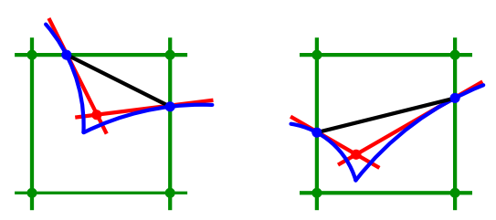
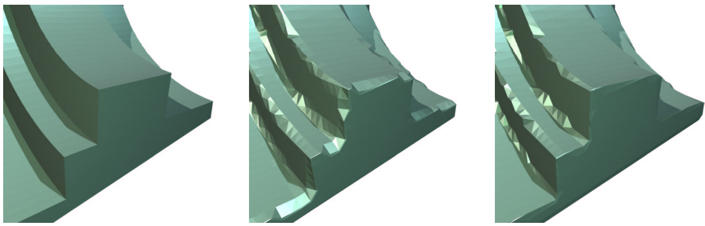

# Marching Cube Study Note (12 NOV 2021)
[Home](../README.md)

## Explicit Surface and Implicit Surface[1](#footnote_1)

There are two types of surfaces to understand beforehand. The **Explicit Surface** and the **[Implicit Surface](https://en.wikipedia.org/wiki/Implicit_surface)**. Explicit surface is a surface that has every vertices, indices described. Thus all the vertices and indices information that we feed to OpenGL or DirectX is an explicit surface. In the other hand, implicit surface is where functions in form of F(x, y, z) = 0 is used. x + 2y - 3z + 1 = 0 is an equation of a plane in 3d space. In order to render this plane, however, we ultimately need an explicit representation of the function.

## Conversion to Polyhedral Meshes[2](#footnote_2)

In order to convert implicit surface into explicit surface, we must understand the process by images rather than words. First of all, imagine that a space is separated by an invisible uniform grids. For all the vertices of a grid, we can use their coordinate vector and use that as an argument to the implicit surface. If the result is equal to zero, that means that the vertex is *exactly on* the surface, if it is greater than zero, then the vertex is *farther away* from the surface, if it is less than zero, then the vertex is *inside* the surface. For example, if there is at least one vertex that is inside the surface, then at least some kind of mesh is intersecting with the grid. This is the fundamental concept of Marching Cubes.

The above image shows all possibilities in a sample grid. We will discuss each case one by one. To explain the concept in a simple manner, the grid will be considered to be a 1 × 1 × 1 grid, and name the vertices by coordinates, ((0, 0, 0), (1, 0, 0), (1, 1, 0), (0, 1, 0), (0, 0, 1), (1, 0, 1), (1, 1, 1), (0, 1, 1)). We are considering the meshes to be triangular.

1. All the vertices are farther away from the surface, thus no mesh would be inside the grid.
2. Only one vertex (1, 0, 0) is the only vertex inside the surface, thus the mesh will pass through all the edges that contains (1, 0, 0)
3. Two adjacent vertices are inside the surface, thus the meshes will pass through the edges that contains those two vertices except the one that contains both of them.
4. Two non-adjacent vertices are inside the surface. Meshes will pass through the edges that contains those two vertices.
5. Three adjacent vertices are inside the surface. Meshes will pass through the edges that contains those three vertices except the ones that contains two of them ((0, 0, 0) - (0, 1, 0) and (0, 1, 0) - (1, 1, 0)).
6. ...

In order to explain the basic concept, we have not considered the case where a vertex exactly produces 0 with the implicit representation, and places the vertex that mesh passes through to be at the center of the edge. Also, there are cases where there are multiple possibilities to intersect a grid in a given situtation (the 14th case shows two that result in isocurves with no self-intersections).

After this process is over, we have produced a topologically valid isocurve configuration. The next step is to find the correct location on each grid edge and move the midpoint intersection to the correct location.

There are some properties we can gain from the isosurface:
* Each isocurve vertex can be named after the two grid vertices. If an isocurve vertex is between (1, 0, 0) and (1, 1, 0), then we can name the isocurve as (1, 0, 1, 1) by combining the x and y components (1, 0) and (1, 1).
* Each grid can be process one at a time. For each square, we:
    * Find the isocurve vertices.
    * If the vertex is a newly found one, then map it to the vertex table with the vertex name. If the table already contains the vertex, then do nothing.
    * For each new vertex, based on the implicit values of each grid vertices, determine the exact location of the vertex.
    * Add edges by examining the pattern of plusses and minuses, and add them to the edge table
* Resulting set of isocurves will have every vertex to be shared by exactly two edges, thus the isocurves are all simple closed curves or polylines

If a grid vertex has a value of 0, then we trick the algorithm by giving it a small value that is not 0 (for example, a value which is 0.001 times the next smallest vertex value adjacent to it). Then, at the last part of the algorithm, we shrink them to one vertex.

If more than one grid vertices have value 0, then we similarly adjust their value, and adjust the vertices at the end.

### Marching Cubes

1. assume that all grid vertices are non-zero
    * if there's a zero, perturb it by a small random amount
3. compute the isosurface, move the isosurface vertices back to the proper locations

We can represent eight grid vertices pattern as an 8-bit binary number. The pattern then can be made into a lookup table. The actual location would be interpolated afterwards.

A grid edge can contain either no isocurve vertex, or one. If is does have an isocurve vertex, then two adjacent grid shall have a face that shares the isocurve vertices, but the way that isosurface vertices are connected by edges within each copy of the face might not be consistent. If this happens, the resulting model of the isosurface will have edges in the interior of the grid, which is inapproriate. Thus the use 256 models used for the 256 possible cases in the marching cubes algorithm must be pairwise consistent.

## Rendering[3](#foonote_3)

The process of creating a smoother mesh surface by using an algorithm such as marching cubes is called *surface extraction* or *polygonalization* (a.k.a. *polygonization*). We will treat each voxel as a point sample rather than a box, then using eight of these points as the corners to a 2 × 2 × 2 grid.

## Implicit to Parametric[4](#foonote_4)

*Isosurface Extraction* is the conversion from a implicit or volumetric representation to a triangle mesh. The de-facto standard algorithm for isosurface extraction is *marching cubes*.

For each cell that is intersected by the isosurface S, a surface patch is generated based on local criteria. The collection of all these small pieces eventually yields a triangle mesh approximation of the complete isosurface S.

For each grid edge intersecting the surface S, the marching cubes algorithm computes a sample point that approximates this intersection. In terms of the scalar field F, this means that the sign of F differs at the grid edge's endpoints **p**1 and **p**2. Since the trilinear approximation F is actually linear along the grid edges, the intersection point **s** can be found by linear interpolation of the distance values d1 := F(**p**1) and d2 := F(**p**2) at the edge's endpoints:

<strong>s</strong> = (|d2| / (|d1| + |d2|)) <strong>p</strong>1 + (|d1| / (|d1| + |d2|)) <strong>p</strong>2

The resulting sample points of each cell are then connected to a triangulated surface patch based on a triangulation look-up table holding all possible configurations of edge intersections. Since the possible combinatorial configurations are determined by the signs at a cell's corners, their number, and hence the size of the table, is 28 = 256.

There are some ambiguity that leads to cracks in the extracted surface. A properly modified look-up table would yield a simple and efficient solution, however, at the price of sacrificing the symmetry with regard to sign inversion of F [Montani et al. 94][5](#footnote_5). The resulting isosurfaces then are watertight 2-manifolds, which is exploited by many mesh repair techniques.

Marching cubes computes intersection points on the edges of a regular grid only. A faithful reconstruction of sharp features requires additional sample points within the cells containing them. The Extended Marching Cubes algorithm [Kobbelt et al. 01][6](#footnote_6) therefore examines the distance function's gradient ∇F to detect those cells that contain a sharp feature and to find additional sample points by intersecting the estimated tangent planes at the edge intersection points of the voxel.

An example implementation of extended marching cubes based on the OpenMesh data structure [Botsch et al. 02][7](#footnote_7) can be downloaded from [Kobbelt et al. 05][8](#footnote_8).

## Contouring[9](#footnote_9)

Reconstructing a mesh of the zero isocontour is a common operation for level sets. The standard approach is the Marching Cubes algorithm, invented first by Wyvill et al.[10](#footnote_10), and then independently by Lorensen and Cline[11](#footnote_11). The essential idea is to put a mesh vertex wherever the zero isosurfaces crosses an edge of the 3D grid, and then connect up the vertices with faces inside each grid cell which will naturally approximate the zero isosurface.

Finding if and where the zero isosurface crosses an edge of the grid is easy enough, assuming linear interpolation of the level set function between values stored at grid cell corners. For example, there is a zero crossing on the edge between (i, j, k) and (i + 1, j, k) if and only if the sign of &Phi;i, j, k is opposite the sign of &Phi;i + 1, j, k, and the zero of the linear interpolant between those two points happens at fraction

&theta; = &Phi;i, j, k / (&Phi;i, j, k - &Phi;i - 1, j, k)

i.e. at location ((i + &theta;)&Delta;x, j&Delta;x, k&Delta;x).

If one or more of the level set values on the grid is exactly zero, &Phi;i, j, k = 0, it can be really hard to make a robust algorithm which will produce a watertight mesh. The simplest solution is to replace any exact zeros with an extremely small nonzero instead, like 10-36 for single-precision floating point numbers. A number this small will not in general have any effect on the location of mesh vertices, due to rounding errors, but it will avoid the need for any special cases in the mesh generation code which is a huge advantage.

In a grid cell which contains the zero isosurface, i.e. which has differing signs for &Phi; at its corners, figuring out how to connect up the mesh vertices generated on the appropriate edges is not trivial. There are 254 different cases to consider, and even with look-up tables to help control the complexity, Lorensen and Cline's original method still on occasion produces holes in the final mesh due to topological ambiguities[12](#footnote_12). Preferable solution to this is Marching Tetrahedra[13](#footnote_13) where we first decompose each grid cell into a set of smaller tetrahedra (which themselves line up at shared grid faces to form a valid tetrahedral mesh of all space), construct zero crossing vertices on the edges of the tetrahedra, and connect up the vertices to form mesh faces within each tetrahedron independently.

The triangular meshes generated from marching typically aren't of great quality. If the isosurface just barely includes a grid point, then the triangles generated nearby will often be "slivers", with one or more very short edges. In most scenarios some further mesh smoothing is required: move each vertex towards the average of its neighbor vertices, then project it back to the zero isosurface using the underlying level set. This tends to produce much better shaped triangles of more uniform size, while staying faithful to the level set.

## Marching Cubes Isosurfaces[14](#footnote_14)

### Algorithm:

1. `main(argc, argv)`
2. `runGraphicsTest(argc, argv)`
    1. `initGL(argc, argv)`
    2. `findCudaDevice(argc, argv)`
    3. register callbacks to glut
    4. `initMC(argc, argv)`
        1. set grid sizes to (25, 25, 25), `0001 0000`
        2. set grid size mask to (25 - 1, 25 - 1, 25 - 1), `0000 1111`
        3. set grid size shift to (0, 5, 10)
        4. set number of voxels = 25 * 25 * 25 = 32,768
        5. set voxel size = (2.0f / gridSize)
        6. set maximum vertices = gridSize.x * gridSize.y * 100
        7. load sample volume data and copy them to the GPU memory
        8. create volume texture in cuda
        9. create vbo's for positions and normals
        10. `allocateTextures(deviceEdgeTable, deviceTriTable, deviceNumVertsTable)`
        11. allocate gpu memory
            1. voxel vertices
            2. voxel vertices scan
            3. voxel occupied
            4. voxel occupied scan
            5. compacted voxel array
3. `display()`
    1. `computeIsosurface()`
        1. calculate number of vertices need per voxel by `launch_classifyVoxel(grid, threads, voxelVertices, voxelOccupied, volume, gridSize, gridSizeShift, gridSizeMask, numVoxels, voxelSize, isoValue)`
            1. calculate number of vertices need per voxel by `classifyVoxel(voxelVertices, voxelOccupied, volume, gridSize, gridSizeShift, gridSizeMask, numVoxels, voxelSize, isoValue, numVerticesTextureObject, volumeTextureObject)`
            2. scan voxel occupied array by `ThrustScanWrapper(output, input, numElements)`
            3. read back values to calculate total number of non-empty voxels since we are using an exclusive scan, the total is the last value of the scan result plus the last value in the input array
            4. if there are no active/full voxels, then return.
            5. compact voxel index array by `launch_compactVoxels(grid, threads, compactedVoxelArray, voxelOccupied, voxelOccupiedScan, numVoxels)`
            6. scan voxel vertex count array by `ThrustScanWrapper(output, input, numElements)`
            7. readback total number of vertices
            8. generate triangles, writing to vertex buffers
            9. skip empty voxels
            10. `launch_generateTriangles2(grid, threads, pos, norm, compactedVoxelArray, numVertsScanned, volume, gridSize, gridSizeShift, gridSizeMask, voxelSize, isoValue, activeVoxels, maxVerts)`
    2. display with gl
        1. set view matrix
        2. lighting
        3. `renderIsosurface()`

---

1. This paragraph is based on the book <a href="https://fluidenginedevelopment.org/">&lt;The Fluid Engine Development></a> by Doyub Kim

2. This paragraph is based on the book <a href="https://en.wikipedia.org/wiki/Computer_Graphics:_Principles_and_Practice">&lt;Computer Graphics Principles Practice></a> by James D. Foley, Andries van Dam, Steven K. Feiner, John Hughes, Morgan McGuire, David F. Sklar, and Kurt Akeley

3. This paragraph is based on the book <a href="https://www.realtimerendering.com/">&lt;Real-Time Rendering></a> by Tomas Akenine-Möller, Eric Haines, Naty Hoffman, Angelo Pesce, Michał Iwanicki, and Sébastien Hillaire

4. This paragraph is based on the book <a href="http://www.pmp-book.org/">&lt;Polygon Mesh Processing></a> by Leif Kobbelt, Mario Botsch, and Mark Pauly

5. C. Montani, R. Scateni, and R. Scopigno. <a href="https://link.springer.com/article/10.1007%2FBF01900830">“A Modified Look-up Table for Implicit Disambiguation of Marching Cubes.”</a> The Visual Computer 10:6 (1994), 353–55.

6. L. Kobbelt, M. Botsch, U. Schwanecke, and H.-P. Seidel. <a href="https://www.graphics.rwth-aachen.de/media/papers/feature1.pdf">“Feature Sensitive Surface Extraction from Volume Data.”</a> In Proc. of ACM SIGGRAPH, pp. 57–66. New York: ACM, 2001.

7. M. Botsch, S. Steinberg, S. Bischoff, and L. Kobbelt. <a href="https://www.graphics.rwth-aachen.de/media/papers/openmesh1.pdf">“OpenMesh – a generic and efficient polygon mesh data structure.”</a> Presented at the OpenSG Symposium 02, 2002

8. L. Kobbelt, M. Botsch, U. Schwanecke, and H.-P. Seidel. <a href="https://www.graphics.rwth-aachen.de/software/feature-sensitive-surface-extraction/">“Extended Marching Cubes Implementation.”</a> , 2002–2005.

9. This paragraph is based on the book <a href="https://www.cs.ubc.ca/~rbridson/fluidsimulation/">&lt;Fluid Simulation></a> by Robert Bridson

10. Geoff Wyvill, Craig McPheeters, and Brian Wyvill. <a href="https://citeseerx.ist.psu.edu/viewdoc/download?doi=10.1.1.881.7066&rep=rep1&type=pdf">Data Structure for Soft Objects.</a> The Visual Computer, 2(4):227–234, February 1986.

11. William E. Lorensen and Harvey E. Cline. <a href="https://dl.acm.org/doi/abs/10.1145/37402.37422">Marching cubes: A high resolution 3d surface construction algorithm.</a> In Proc. ACM SIGGRAPH, pages 163–169, 1987.

12. Martin J. Dürst. 1988. <a href="https://dl.acm.org/doi/10.1145/378267.378271">Re: additional reference to "marching cubes".</a> SIGGRAPH Comput. Graph. 22, 5 (Oct. 1988), 243.

13. Heinrich Müller and Michael Wehle. <a href="https://www.computer.org/csdl/proceedings-article/dagstuhl/1997/05030243/12OmNAnMuwa">Visualization of implicit surfaces using adaptive tetrahedrizations.</a> In Dagstuhl ’97, Scientific Visualization, pages 243–250, 1999.

14. NVIDA CUDA Samples for Marching Cubes: <a href="https://docs.nvidia.com/cuda/cuda-samples/index.html#marching-cubes-isosurfaces">Link</a>

