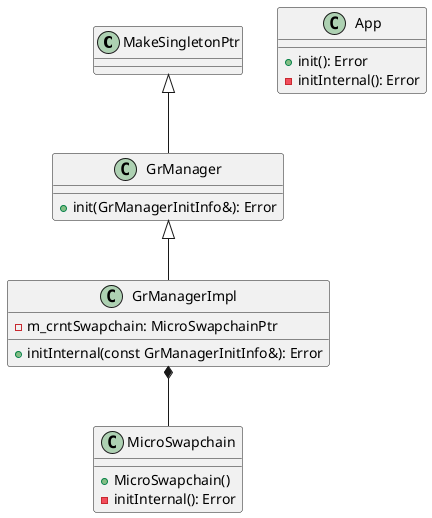
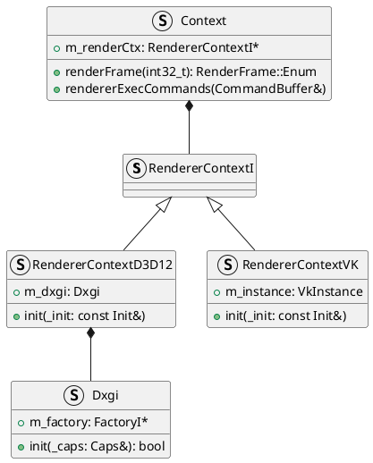

- [Game Engine RHI System Analysis Series 1: Instance (2024.11.25)](#game-engine-rhi-system-analysis-series-1-instance-20241125)
- [Overview](#overview)
  - [Anki](#anki)
  - [BGFX](#bgfx)
  - [Diligent Engine](#diligent-engine)
  - [Filament](#filament)

# Overview

In order to use a Graphics API, once has to initialize something called an **Instance**. In Direct3D, the Microsoft DirectX Graphics Infrastructure or DXGI is the instance, and in Vulkan, [`VkInstance`](https://registry.khronos.org/vulkan/specs/1.3-extensions/man/html/VkInstance.html) is the instance.

The primary goal of DXGI is to manage low-level tasks that can be independent of the DirectX graphics runtime. DXGI provides a common framework for future graphics components. DXGI's purpose is to communicate with the kernel mode driver and the system hardware, as shown in the following diagram.

There is no global state in Vulkan and all per-application state is stored in a [`VkInstance`](https://registry.khronos.org/vulkan/specs/1.3-extensions/man/html/VkInstance.html) object. Creating a [`VkInstance`](https://registry.khronos.org/vulkan/specs/1.3-extensions/man/html/VkInstance.html) object initializes the Vulkan library and allows the application to pass information about itself to the implementation.

## Anki

Anki does not keep the `IDXGIFactory` in memory. It is created via `CreateDXGIFactory` API call when needed.

When initializing their graphics manager, Anki creates an [`IDXGIFactory6`](https://learn.microsoft.com/en-us/windows/win32/api/dxgi1_6/nn-dxgi1_6-idxgifactory6) by creating a [`IDXGIFactory2`](https://learn.microsoft.com/en-us/windows/win32/api/dxgi1_2/nn-dxgi1_2-idxgifactory2) from the [`CreateDXGIFactory2(UINT, REFIID, void**)`](https://learn.microsoft.com/en-us/windows/win32/api/dxgi1_3/nf-dxgi1_3-createdxgifactory2) API call, then querying `IDXGIFactory6` from the created `IDXGIFactory2` instance.

If GPU validation is required, then `DXGI_CREATE_FACTORY_DEBUG` flag is set when creating an instance.

Anki then queries the physical device(`IDXGIAdapter`s).

When creating a swap chain, an [`IDXGIFactory2`](https://learn.microsoft.com/en-us/windows/win32/api/dxgi1_2/nn-dxgi1_2-idxgifactory2) is created by the [`CreateDXGIFactory2(UINT, REFIID, void**)`](https://learn.microsoft.com/en-us/windows/win32/api/dxgi1_3/nf-dxgi1_3-createdxgifactory2) API call. The created instance is used to create a swap chain by the [`IDXGIFactory2::CreateSwapChainForHwnd(IUnknown*, HWND, const DXGI_SWAP_CHAIN_DESC1*, const DXGI_SWAP_CHAIN_FULLSCREEN_DESC*, IDXGIOutput*, IDXGISwapChain1)`](https://learn.microsoft.com/en-us/windows/win32/api/dxgi1_2/nf-dxgi1_2-idxgifactory2-createswapchainforhwnd). Anki does not support fullscreen transitions, so the instance is used to call [`IDXGIFactory::MakeWindowAssociation(HWND, UINT)`](https://learn.microsoft.com/en-us/windows/win32/api/dxgi/nf-dxgi-idxgifactory-makewindowassociation).

All these initializations happens when the graphics manager is initialized.

Just like D3D12, [`VkInstance`](https://registry.khronos.org/vulkan/specs/1.3-extensions/man/html/VkInstance.html) is initialized in the graphics manager. Unlike `IDXGIFactory`, [`VkInstance`](https://registry.khronos.org/vulkan/specs/1.3-extensions/man/html/VkInstance.html) is kept by the manager for future uses.

Instance creation in Vulkan is more complex compared to DirectX 12. In order to initialize an instance in Vulkan, one has to provide an application information [`VkApplicationInfo`](https://registry.khronos.org/vulkan/specs/1.3-extensions/man/html/VkApplicationInfo.html), an array of instance layers to enable, validation features [`VkValidationFeaturesEXT`](https://registry.khronos.org/vulkan/specs/1.3-extensions/man/html/VkValidationFeaturesEXT.html), and an array of extensions to enable.

Anki uses [`VK_LAYER_KHRONOS_validation`](https://github.com/KhronosGroup/Vulkan-ValidationLayers/blob/main/docs/khronos_validation_layer.md) instance layer if GPU validation is enabled. User can provide instance layers via command-line argument.

Anki supports [`VK_VALIDATION_FEATURE_ENABLE_DEBUG_PRINTF_EXT`](https://docs.vulkan.org/samples/latest/samples/extensions/shader_debugprintf/README.html) if enabled. If GPU validation is enabled, [`VK_VALIDATION_FEATURE_ENABLE_GPU_ASSISTED_EXT`](https://registry.khronos.org/vulkan/specs/1.3-extensions/man/html/VkValidationFeatureEnableEXT.html) is added to enabled validation features.

If user is using headless surface, [`VK_EXT_headless_surface`](https://registry.khronos.org/vulkan/specs/1.3-extensions/man/html/VK_EXT_headless_surface.html) instance extension is used. If the user is using Linux OS, [VK_KHR_wayland_surface](https://registry.khronos.org/vulkan/specs/1.3-extensions/man/html/VK_KHR_wayland_surface.html) extension is used, [`VK_KHR_win32_surface`](https://registry.khronos.org/vulkan/specs/1.3-extensions/man/html/VK_KHR_win32_surface.html) for Windows, [VK_KHR_android_surface](https://registry.khronos.org/vulkan/specs/1.3-extensions/man/html/VK_KHR_android_surface.html) for Android. To support swap chains, [VK_KHR_surface](https://registry.khronos.org/vulkan/specs/1.3-extensions/man/html/VK_KHR_surface.html) extension is used. If GPU validation is enabled, [VK_EXT_debug_utils](https://registry.khronos.org/vulkan/specs/1.3-extensions/man/html/VK_EXT_debug_utils.html) extension is used.

After creating the instance, Anki uses [Volk](https://github.com/zeux/volk) to load all required Vulkan entrypoints using `volkLoadInstance(VkInstance)`, sets debug callbacks with [`vkCreateDebugUtilsMessengerEXT(VkInstance, const VkDebugUtilsMessengerCreateInfoEXT*, const VkAllocationCallbacks*, VkDebugUtilsMessengerEXT*)`](https://registry.khronos.org/vulkan/specs/1.3-extensions/man/html/vkCreateDebugUtilsMessengerEXT.html), and creates the physical device with [`vkEnumeratePhysicalDevices(VkInstance, uint32_t*, VkPhysicalDevice*)`](https://registry.khronos.org/vulkan/specs/1.3-extensions/man/html/vkEnumeratePhysicalDevices.html).

When instance initialization is over, instance is used to create the surface. Anki supports surface creation via SDL, for Android, and for headless case.

Instance is later used when DLSS needs to be initialized. This is initialized when renderer initializes the renderer objects. One of the renderer objects, `TemporalUpscaler` uses a `GrUpscaler` that which can use DLSS.

Both graphics manager `GrManager` and renderer `Renderer` is initialized when the application `App` is initialized.

## BGFX

* D3D12
  1. Open [`WinPixEventRuntime.dll`](https://devblogs.microsoft.com/pix/winpixeventruntime/)
  2. Get symbols to `PIXEventsThreadInfo` and set `PIXEventsReplaceBlock` to zero
  3. Load [RenderDoc](https://renderdoc.org/)
     1. Skip RenderDoc if [IntelGPA](https://www.intel.com/content/www/us/en/developer/tools/graphics-performance-analyzers/overview.html) is running (check `shimloader32.dll` or `shimloader64.dll`)
     2. Check if module `renderdoc.dll` is already injected, open the dll if not injected
     3. Get symbols to `RENDERDOC_GetAPI` and initialize RenderDoc
  4. Initialize uniforms and resolution to zero
  5. Open [`kernel32.dll`](https://en.wikipedia.org/wiki/Microsoft_Windows_library_files#KERNEL32.DLL)
     1. Get symbol to `CreateEventExA`
  6. Open [`nvapi.dll` / `nvapi64.dll`](https://developer.nvidia.com/rtx/path-tracing/nvapi/get-started)
     1. Get symbol to `nvapi_QueryInterface`
     2. Initialize NVAPI
     3. Enumeration physical GPUs, and set the first GPU as the main NVIDIA GPU
  7. Open `d3d12.dll` (`libd3d12.so` in Linux)
     1. Find crucial symbols in D3D12 (`D3D12CreateDevice`, `D3D12GetDebugInterface`, `D3D12SerializeRootSignature`, etc.)
  8. Open `dxgi.dll` (`dxgi.so` in Linux)
     1. Open `dxgidebug.dll`
        1. Get symbols to `DXGIGetDebugInterface`, `DXGIGetDebugInterface1`
     2. Get symbols to `CreateDXGIFactory1` / `CreateDXGIFactory`
     3. Create a factory
        1. Enumerate adapters (GPUs)
           1. Enumerate outputs (monitors)
              1. Check features (HDR10, transparent back buffer, etc.)
           2. Set the first adapter as the main adapter
           3. Set the first output as the main output
  9. Initialize D3D12 Debug Layer
  10. Create the D3D12 Device with the highest feature level
  11. Query the most recent DXGI Device interface
  12. Query the most recent D3D12 Device interface
  13. Shutdown NVAPI if current chosen vendor is not NVIDIA
  14. For each nodes in the D3D12 Device, check their architecture, and keep the first node's architecture
  15. Check D3D12 feature options
  16. Get heap properties of Custom, Default, Upload, Readback from the D3D12 Device
  17. Create a Direct command queue and its fence
      1.  Create command allocators for direct command lists
          1.  Create a direct command list and close it
  18. Initialize swap chain
      1.  Check MSAA support
      2.  Check tearing support
      3.  Create swap chain
      4.  Query the most recent swap chain interface
      5.  Check the color space support
      6.  Set the color space according to the swap chain's format
      7.  Check the display specs of the output containing the swap chain
      8.  Set the HDR10 meta data
  19. Initialize D3D12 Info Queues
  20. Create RTV, DSV heap
  21. Create scratch buffers (size = max draw calls * 1024, descriptors = max textures + max shaders + max draw calls)
      1.  Create CBV/SRV/UAV heap
      2.  Create committed resource with upload heap properties (custom heap type)
      3.  Map to CPU data
  22. Create sampler allocator
      1.  Create sampler heap
  23. Create descriptor ranges with each range having a single descriptor type
      1.  sampler (N)
      2.  SRV (N)
      3.  CBV (1)
      4.  UAV (N)
  24. Create root parameters
      1.  Descriptor table: sampler range
      2.  Descriptor table: SRV range
      3.  Root CBV: register space=0, shader register=0
      4.  Descriptor table: UAV range
  25. Create a root signature
  26. Check direct access support (UMA)
  27. Check resource supports
  28. Check limits
  29. For every formats,
      1.  Check if format is supported for various types (texture2d, texture3d, etc.)
      2.  If the format could be read as texture image, check for UAV RW suports
      3.  Check if the format's corresponding SRGB format is supported for various SRGB types (texture2d, texture3d, etc.)
  30. Create RTVs for each swap chain buffers
  31. Allocate a command list from command allocator by resetting the command list
  32. Create a depth-stencil buffer from a heap of default heap properties
  33. Create a DSV
  34. Set a resource barrier of depth-stencil buffer from common state to depth write state
  35. Set indirect arguments
      1.  VBV 0
      2.  VBV 1
      3.  VBV 2
      4.  VBV 3
      5.  VBV 4
      6.  CBV 2
      7.  DRAW 0
  36. Create a draw command signature
  37. Set indirect arguments
      1.  VBV 0
      2.  VBV 1
      3.  VBV 2
      4.  VBV 3
      5.  VBV 4
      6.  IBV 0
      7.  CBV 2
      8.  DRAW INDEXED 0
  38. Create a draw indexed command signature
  39. Create commands for each draw type per batch
  40. Create indirects (size=max draw per batch * command size)
  41. Initialize GPU timer
      1.  Create query heap
      2.  Create read back resource
      3.  Get timestamp frequency
      4.  Map read back buffer to query result
      5.  Reset results and control
  42. Initialize occlusion query
      1.  Create query heap
      2.  Create read back resource
      3.  Map read back buffer to result
  43. Create command signatures for Dispatch, Draw, and Draw Indexed
  44. If NVAPI is initialized,
      1.  Kick the command queue
          1.  Close the command list
          2.  Execute command lists
          3.  Create fence event
          4.  Let command queue signal fence value
          5.  Set fence event on completion
          6.  Commit a control (+1 write +1 current)
      2.  Finish the command queue
          1.  If there exist an available control,
              1.  Consume the command queue
                  1.  Wait for the fence event
                  2.  Close the fence event
                  3.  Set the completed fence value
                  4.  Check if GPU has passed the fence via command queue wait
                  5.  Release read resources
                  6.  Consume a control (+1 read)
      3.  Initialize [Aftermath](https://developer.nvidia.com/nsight-aftermath)
          1.  Open `GFSDK_Aftermath_Lib.x86.dll` / `GFSDK_Aftermath_Lib.x64.dll`
          2.  Get necessary symbols
          3.  Initialize Aftermath
* Vulkan
  1.  Just like D3D12, load RenderDoc
  2.  Open `vulkan-1.dll` / `libvulkan.so` (Android) / `libMoltenVK.dylib` (OSX) / `libvulkan.so.1`
  3.  Import crucial vulkan functions
  4.  Set layers/extensions needed
      1.  `VK_LAYER_LUNARG_standard_validation` (disabled if `VK_LAYER_KHRONOS_validation` is supported)
      2.  `VK_LAYER_KHRONOS_validation`
      1.  `VK_EXT_debug_report`
      2.  `VK_EXT_shader_viewport_index_layer`
      3.  `VK_EXT_conservative_rasterization`
      4.  `VK_KHR_draw_indirect_count`
      5.  `VK_EXT_custom_border_color`
      6.  `VK_EXT_debug_utils`
      7.  `VK_EXT_line_rasterization`
      8.  `VK_EXT_memory_budget`
      9.  `VK_KHR_get_physical_device_properties2`
      10. `VK_KHR_win32_surface` / `VK_KHR_android_surface` / `VK_KHR_wayland_surface` / `VK_KHR_xlib_surface` / `VK_KHR_xcb_surface` / `VK_MVK_MACOS_SURFACE_EXTENSION_NAME` / `VK_NN_VI_SURFACE_EXTENSION_NAME`
  5.  Create Vulkan instance
  6.  Import Vulkan instance API calls
  7.  Initialize Debug Layer if extension `VK_EXT_debug_report` is supported
  8.  Enumerate physical devices
      1.  Check availabe extensions
  9.  Set the first one to be the main physical device
  10. Get and check physical device features/limits (custom border color, line rasterization, etc.)
  11. Update MSAA support
  12. For every texture formats,
      1.  Check their MSAA support per image type/usage bit, etc.
  13. Get physical device's memory properties
  14. Get query family properties, and get the global queue family that supports graphics and compute
  15. Create a Vulkan device with a global queue from the global queue family
  16. Import Vulkan logical device API calls
  17. Get the global queue
  18. For number of required frame buffers,
      1.  Create a command pool
      2.  Allocate a command buffer from the pool
      3.  Create a fence
  19. Allocate a command buffer
      1.  Wait for fences
      2.  Reset command pool
      3.  Begin command buffer
  20. Create back buffers
      1.  Create swap chain
          1.  Create a surface and check if the physical device supports the surface
          2.  Create swap chain with appropriate format, present mode, etc.
          3.  Create attachments
              1.  For each swap chain images, create image views
              2.  Create present/render semaphores per back buffers
              3.  Create depth-stencil attachment
                  1.  Create image
                  2.  Allocate device memory according to the image memory requirements
                  3.  Bind image to the device memory
                  4.  Set image memory barrier from undefined to depth-stencil attachment optimal
              4.  Create depth-stencil image view
          4.  Create frame buffers
              1.  Create a render pass that uses back buffers
              2.  Create Vulkan frame buffers using created render passes
  21. Create descriptor pools
      1.  Sampled image: max descriptor sets * max texture samplers
      2.  Sampler: max descriptor sets * max texture samplers
      3.  Uniform buffer dynamic: max descriptor sets * 2
      4.  Storage buffer: max descriptor sets * max texture samplers
      5.  Storage image: max descriptor sets * max texture samplers
  22. Create pipeline cache
  23. For each frame buffers, create scratch buffers
      1.  Create uniform buffer
      2.  Allocate device memory
      3.  Bind buffer to device memory
      4.  Map device memory to CPU data
  24. For each frame buffers, create scratch staging buffers
      1.  Create staging buffer (transfer dst/src bit set)
  25. Initialize GPU timer
      1.  Create query pool
      2.  Record query pool reset command to command buffer
      3.  Create read back host buffer
      4.  Map read back memory to query result
      5.  Reset results and control
  26. Initialize occlusion query
      1.  Create query pool
      2.  Record query pool reset command to command buffer
      3.  Create read back host buffer
      4.  Map read back memory to query result
      5.  Reset control

BGFX has a `Dxgi` struct where it manages the DXGI instances such as the `IDXGIFactory`. When running the application, the engine initializes the instance when available during the main loop(`Context::renderFrame`). Context has a renderer context, which has the instance.

Enabled layers:
* `VK_LAYER_KHRONOS_validation`

Enabled extensions:
* `VK_KHR_surface`
* `VK_EXT_debug_report`
* `VK_EXT_debug_utils`
* `VK_KHR_get_physical_device_properties2`
* `VK_KHR_win32_surface`

## Diligent Engine

Diligent engine does not keep track of the DXGI adapter / factory. The adapter can be retrieved from the D3D12 device by the LUID, and the factory can be created any time.

1. Load `d3d12.dll`
2. Find Adapters
   1. Create a DXGI Factory `CreateDXGIFactory1`
   2. Enumerate adapters and check if adapter can create a D3D12 device using minimum feature level ([`IDXGIFactory::EnumAdapters`](https://learn.microsoft.com/en-us/windows/win32/api/dxgi/nf-dxgi-idxgifactory-enumadapters))
   3. For each enumerated adapter,
      1. Create the D3D12 Device that supports the highest feature level
      2. Check supported features
      3. If tiled resource tier is greater or equal to 1, load NVAPI (if NVPAI is enabled)
      4. Check outputs
   4. For each enumerated adapters,
      1. Get the best adapter (discrete > integrated, more memory)
   5. Get display modes ([`IDXGIOutput::GetDisplayModeList`](https://learn.microsoft.com/en-us/windows/win32/direct3d11/overviews-direct3d-11-devices-get-adapter-info))
   6. Create debug layer
   7. Create DXGI factory and get the predetermined adapter, and create a D3D12 device that supports the highest feature level
   8. Create the info queue
   9. Create a direct command queue as the default immediate context, and its fence
   10. Create a diligent engine's D3D12 render device
       1.  Create query managers
       2.  Create shader compilation thread pool
   11. For each immediate contexts,
       1.  Create a diligent engine's D3D12 immediate context
   12. Create a swap chain
   13. Create a FrameLatencyWaitableObject from the swap chain [`IDXGISwapChain2::GetFrameLatencyWaitableObject`](https://learn.microsoft.com/en-us/windows/win32/api/dxgi1_3/nf-dxgi1_3-idxgiswapchain2-getframelatencywaitableobject)
   14. Create a texture for each back buffers, and create their RTVs
   15. Create a depth buffer texture, and it DSV

Vulkan:

1. Find Adapters
   1. Create Vulkan instance
      1. Initialize Volk
         1. Load `vulkan-1.dll`
         2. Use volk to load Vulkan functions
      2. Add instance extensions
         1. `VK_KHR_surface`
         2. `VK_KHR_win32_surface` / `VK_KHR_android_surface` / `VK_KHR_wayland_surface` / `VK_KHR_xlib_surface` / `VK_KHR_xcb_surface` / `VK_EXT_metal_surface`
         3. `VK_KHR_get_physical_device_properties2`
      3. Create Vulkan instance
      4. Load instance-related function using Volk
      5. Set up debug layer
      6. Enumerate physical devices
      7. For each devices,
         1. Get properties, features, memory properties, queue family properties
         2. Check supported extensions and add features to query accordingly
            1. `VK_KHR_shader_float16_int8`,
            2. `VK_KHR_storage_buffer_storage_class`
               1. `VK_KHR_16bit_storage`
               2. `VK_KHR_8bit_storage`
            3. `VK_EXT_mesh_shader`
            4. `VK_KHR_acceleration_structure`
            5. `VK_KHR_ray_tracing_pipeline`
            6. `VK_KHR_ray_query`
            7. `VK_KHR_buffer_device_address`
            8. `VK_EXT_descriptor_indexing`
            9. `VK_KHR_spirv_1_4`
            10. `VK_KHR_portability_subset`
            11. `VK_EXT_vertex_attribute_divisor`
            12. `VK_KHR_timeline_semaphore`
            13. `VK_KHR_multiview`
            14. `VK_KHR_create_renderpass2`
            15. `VK_KHR_fragment_shading_rate`
            16. `VK_EXT_fragment_density_map`
            17. `VK_EXT_host_query_reset`
            18. `VK_KHR_draw_indirect_count`
            19. `VK_KHR_maintenance3`
            20. `VK_EXT_multi_draw`
         3. Check physical device info
      8. For each enumerated adapters,
         1. Get the best adapter (discrete > integrated, more memory)
2. Create device and contexts
   1. Use device extensions
      1. `VK_KHR_swapchain`
      2. `VK_KHR_maintenance1`
      4. `VK_EXT_mesh_shader`
      5. `VK_KHR_shader_float16_int8`,
      6. `VK_KHR_storage_buffer_storage_class`
         1. `VK_KHR_16bit_storage`
         2. `VK_KHR_8bit_storage`
      7. `VK_KHR_acceleration_structure`
      8. `VK_KHR_ray_tracing_pipeline`
      9. `VK_KHR_ray_query`
      10. `VK_KHR_buffer_device_address`
      11. `VK_EXT_descriptor_indexing`
      12. `VK_KHR_spirv_1_4`
      13. `VK_KHR_portability_subset`
      14. `VK_EXT_vertex_attribute_divisor`
      15. `VK_KHR_timeline_semaphore`
      16. `VK_KHR_multiview`
      17. `VK_KHR_create_renderpass2`
      18. `VK_KHR_fragment_shading_rate`
      19. `VK_EXT_fragment_density_map`
      20. `VK_EXT_host_query_reset`
      21. `VK_KHR_draw_indirect_count`
      22. `VK_KHR_maintenance3`
      23. `VK_KHR_maintenance2`
      24. `VK_EXT_multi_draw`
   2. Enable device features
   3. Enumerate a queue that supports both graphics and compute queue flags
   4. Create a logical device
   5. Use volk to load related functions
   6. Enable features
   7. Create a graphics context queue (from the Vulkan queue we enumerated)
   8. Create a Vulkan render device
      1. Create transient command pool managers and query manager per command queues
      2. Create shader compilation thread pool
   9. Create a Vulkan device context
      1.  Allocate a command buffer and begin
      2.  Reset stale queries
      3.  Create a dummy vertex buffer
      4.  Create a AS compacted size query pool
   10. Set created device context as the immediate context of the render device
3.  Create swap chain
    1.  Create a surface
    2.  Check if the current queue can present to the given surface
    3.  Check which supported formats support the current color format
    4.  Check surface capabilities and present modes
    5.  Set present modes based on VSync support
        1.  If VSync enabled
            1.  FIFO relaxed
            2.  FIFO
        2.  Else Vsync disabled
            1.  Mailbox
            2.  Immediate
            3.  FIFO
    6.  Set the number of back buffers based on the hardware limits and the desire back buffer count
    7.  Create Vulkan swap chain
    8.  For each back buffers,
        1.  Create some semaphores for
            1.  Image acquisition
            2.  Draw completion
        2.  Create a image acquition fence
    9.  For each back buffers
        1.  Create a texture
        2.  Create RTV
    10. Create a depth buffer texture
    11. Create default DSV

## Filament

1. Create instance
   1. Add `VK_LAYER_KHRONOS_validation` if validation is enabled
   2. Create Vulkan instance (`vkCreateInstance`)
   3. Load functions (using BlueVK)
2. Select physical device
   1. Enumerate devices (`vkEnumeratePhysicalDevices`)
   2. For each devices,
      1. Get their properties and check versions, graphics bit support (`vkGetPhysicalDeviceProperties`, `vkGetPhysicalDeviceQueueFamilyProperties`)
      2. Enumerate extension properties (`vkEnumerateDeviceExtensionProperties`)
      3. Check for swap chain extension support
   3. Sort devices by device type(discrete/integrated) and pick the best one (discrete > integrated > cpu > virtual gpu > other)
3. Print device info (`vkGetPhysicalDeviceProperties2`, `vkGetPhysicalDeviceProperties`)
4. Check physical device properties, features, and memory properties (`vkGetPhysicalDeviceFeatures2`, `vkGetPhysicalDeviceMemoryProperties`)
5. Select appropriate queues
6. Create logical device (`vkCreateDevice`)
7. Get queue (`vkGetDeviceQueue`)
8. Create Vulkan driver
   1. Create commands
      1. Create command pool (`vkCreateCommandPool`)
         1. Create command buffers, and for each command buffers,
            1. Allocate command buffer from the pool (`vkAllocateCommandBuffers`)
            2. Create submission semaphore (`vkCreateSemaphore`)
            3. Create fence (`vkCreateFence`)
